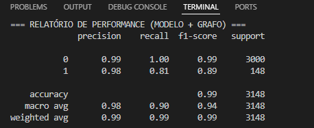
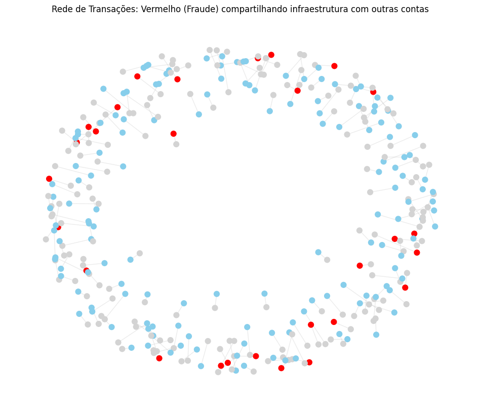
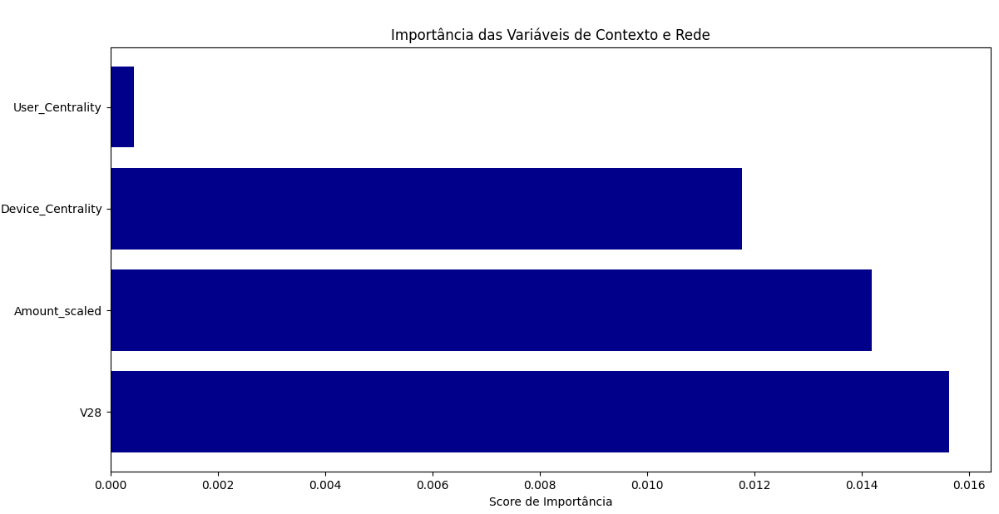
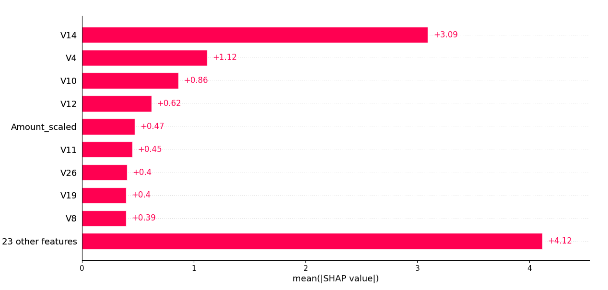

# Detecção de Anomalias em Transações Financeiras com Machine Learning e Análise de Grafos

Este projeto foi desenvolvido como um desafio de projeto prático focado em Engenharia Antifraude, unindo técnicas avançadas de **Ciência de Dados** e conceitos de **Cibersegurança Defensiva**. O objetivo principal é identificar transações fraudulentas de cartão de crédito mitigando o impacto de dados severamente desbalanceados e adicionando contexto de infraestrutura de rede.

---

## 📊 O Problema de Negócio & Segurança

A detecção de fraudes enfrenta dois grandes desafios no mundo real:
1. **Desbalanceamento Extremo:** Transações fraudulentas representam geralmente menos de 1% do volume total. Modelos tradicionais tendem a ignorar a classe minoritária.
2. **Ataques Coordenados (Botnets/ATO):** Analisar transações de forma isolada ignora o comportamento macro dos atacantes, que frequentemente utilizam emuladores ou proxies compartilhados para pulverizar ataques em várias contas simultaneamente.

---

## 🏗️ Arquitetura da Solução

O pipeline do projeto foi estruturado em 4 etapas principais:

1. **Pré-processamento e Engenharia de Features:**
   * Aplicação de transformação logarítmica (`np.log1p`) na variável `Amount` para suavizar a disparidade de valores.
   * Padronização estatística com `StandardScaler`.
2. **Contexto de Segurança com Grafos (`NetworkX`):**
   * Modelagem de um **Grafo Bipartido** conectando IDs de usuários a IDs de dispositivos de acesso.
   * Extração de métricas de **Centralidade de Grau (Degree Centrality)** para identificar anomalias estruturais (ex: um único dispositivo operando dezenas de contas ao mesmo tempo).
3. **Modelagem Preditiva Avançada (`XGBoost`):**
   * Utilização do algoritmo XGBoost com o parâmetro `scale_pos_weight` calibrado para penalizar severamente os falsos negativos.
   * Injeção dos scores do grafo como novas features de treinamento para o modelo de Machine Learning.
4. **Otimização de Limiar de Decisão (Threshold):**
   * Ajuste do limiar crítico de decisão de `0.5` para `0.3`, priorizando a métrica de **Recall** (taxa de captura de fraudes) para reduzir o risco financeiro da operação.

---

## 🛠️ Tecnologias Utilizadas

* **Linguagem:** Python
* **Processamento de Dados:** Pandas, NumPy
* **Machine Learning:** Scikit-Learn, XGBoost, Imbalanced-Learn (SMOTE)
* **Análise de Redes/Grafos:** NetworkX
* **Explicabilidade do Modelo:** SHAP (Shapley Additive exPlanations)
* **Visualização:** Matplotlib

---

## 📈 Resultados e Explicabilidade

O modelo final foi avaliado priorizando o equilíbrio entre o bloqueio de ameaças reais e o controle de fricção com clientes legítimos. Através do uso da biblioteca **SHAP**, foi possível abrir a "caixa-preta" do XGBoost e auditar quais variáveis de rede e contexto foram determinantes para classificar uma transação como anomalia.

### Relatório de Perfomance

### Recorte do grafo

### Nível de Importância das Variáveis

### "Caixa Preta"

### Desenvolvido por Matheus Ramos Dormea
****
---
